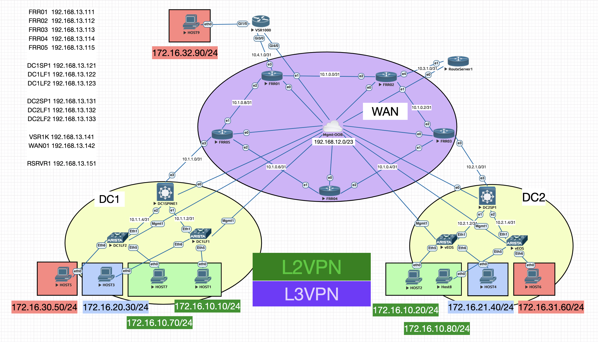

# eveng-lab-evpn-vxlan
EVE-NG Multi-Tenant EVPN/VXLAN Lab topology 

    

## Overview

This lab represents a dual datacenter network design, interconnected via L3 IP WAN / Core.  

Local DataCenter Layer3 Leaf/Spine networks with EVPN overlay (eBGP over eBGP) within each DataCenter offer RED, BLUE, and GREEN tenant services for demo'ing Layer2 and Layer3 network availability.

An additional Layer3 network (RED) is attached to the IP WAN Core network, highlighting insertion of arbitrary Layer3 services into the overlay.

The Out-Of-Band (OOB) management network is a bridge to a network interface on the EVE-NG host offering DHCP services as well as client connectivity to network nodes.

## Node Details
### [FRR01](https://github.com/TEXNUG/eveng-lab-evpn-vxlan/blob/main/node-configs/FRR01.cfg):  WAN Router 1 
- Open Source Node - debian 10 system running FRR
- Attachment point for VSR1K (L3 RED network extension)
### [FRR02](https://github.com/TEXNUG/eveng-lab-evpn-vxlan/blob/main/node-configs/FRR02.cfg):  WAN Router 2
- Open Source Node - debian 10 system running FRR
- Attachment point for RouteServer1 (FRR EVPN Route Server)
### [FRR03](https://github.com/TEXNUG/eveng-lab-evpn-vxlan/blob/main/node-configs/FRR03.cfg):  WAN Router 3
- Open Source Node - debian 10 system running FRR
- Attachment point for DataCenter2
### [FRR04](https://github.com/TEXNUG/eveng-lab-evpn-vxlan/blob/main/node-configs/FRR04.cfg):  WAN Router 4
- Open Source Node - debian 10 system running FRR
### [FRR05](https://github.com/TEXNUG/eveng-lab-evpn-vxlan/blob/main/node-configs/FRR05.cfg):  WAN Router 5
- Open Source Node - debian 10 system running FRR
- Attachment point for DataCenter1
- runs ISIS (WAN), BGP (DC1 peer)
## 
### [DC1SP1](https://github.com/TEXNUG/eveng-lab-evpn-vxlan/blob/main/node-configs/DC1SP1.cfg):  DataCenter 1 Spine
- Open Source Node - debian 10 system running FRR
- runs BGP (L3LS underlay for DC)
- Attachment point for DC1 Leafs
### [DC1LF1:](https://github.com/TEXNUG/eveng-lab-evpn-vxlan/blob/main/node-configs/DC1LF1.cfg)  DataCenter 1 Leaf1
- Arista vEOS-Lab (freely available)
- runs BGP (eBGP underlay, eBGP Overlay)
- Attachment points:
  - Host1 (tenant GREEN)
  - Host3 (tenant BLUE)
### [DC1LF2:](https://github.com/TEXNUG/eveng-lab-evpn-vxlan/blob/main/node-configs/DC1LF2.cfg)  DataCenter 1 Leaf2
- Arista vEOS-Lab (freely available)
- runs BGP (eBGP underlay, eBGP Overlay)
- Attachment points:
  - Host5 (tenant RED)
  - Host7 (tenant GREEN)
##
### [DC2SP1:](https://github.com/TEXNUG/eveng-lab-evpn-vxlan/blob/main/node-configs/DC2SP1.cfg)  DataCenter 2 Spine
- Open Source Node - debian 10 system running FRR
- runs BGP (L3LS underlay for DC)
- Attachment point for DC1 Leafs
### [DC2LF1:](https://github.com/TEXNUG/eveng-lab-evpn-vxlan/blob/main/node-configs/DC2LF1.cfg)  DataCenter 2 Leaf1
- Arista vEOS-Lab (freely available)
- runs BGP (eBGP underlay, eBGP Overlay)
- Attachment points:
  - Host2 (tenant GREEN)
  - Host4 (tenant BLUE)
### [DC2LF2:](https://github.com/TEXNUG/eveng-lab-evpn-vxlan/blob/main/node-configs/DC2LF2.cfg)  DataCenter 2 Leaf2
- Arista vEOS-Lab (freely available)
- runs BGP (eBGP underlay, eBGP Overlay)
- Attachment points:
  - Host6 (tenant RED)
  - Host8 (tenant GREEN)
##
# HINTS AND CLUES
## Management Network
- Lab was built with a bridge to EVE-NG host connected network in subnet 192.168.12.0/23 (gateway 192.168.12.1)
  - all management interface addressing is allocated from this network
  - all management routing referencing this network is to enable client / remote connectivity to lab (some nodes implement isolated management VRF to separate this traffic from "global/default" routing table, many do not)
- Lab was built with publicly available software images; some software requires entitlement from software manufacturer; i.e. registering for an account, agreeing to terms, etc to download
